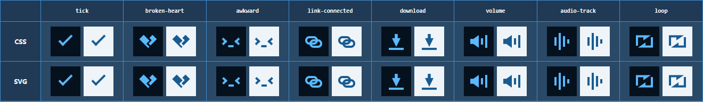

# CSS to SVG Converter

An AI Agent Skill and deterministic Node.js CLI for high-fidelity CSS icon → SVG conversion.



Built specifically for CSS icons, where generic CSS-to-SVG converters tend to lose pseudo-elements, border geometry, clipping, and transform placement. It reads CSS rules directly instead of tracing screenshots, producing reviewable SVG candidates that preserve the icon’s construction.

## Use with an AI Agent

This is a general `SKILL.md`-based skill. Put this repository in the skill directory configured by your AI Agent runtime, then ask the agent to convert CSS icons into SVG candidates and flag anything needing manual review.

```text
<agent-skill-directory>/vs-css-icon-converter
```

For a manual install:

```sh
git clone https://github.com/GitRuozhi/vs-css-icon-converter.git <agent-skill-directory>/vs-css-icon-converter
```

## CLI

Run one icon first and keep the JSON report beside the generated SVG:

```sh
node scripts/convert-icons.mjs --css ./icons.css --icon plus --output ./plus.svg --report ./plus.report.json
```

Add each relevant stylesheet with another `--css` argument. The CLI emits a transparent SVG and reports whether the result is converted or needs `manual-review`.

## Handles

- CSS icon rules and pseudo-elements
- Pixel geometry, borders, border radii, and solid fills
- Rectangular `linear-gradient` layers, polygon `clip-path`, and simple transforms
- 16×16 canvas placement, including non-default root boxes
- Dotted borders as explicit SVG line segments

## Review is intentional

This is not a universal CSS renderer. Some browser layout behavior, advanced transforms, or unsupported declarations need a manual SVG correction. Treat every result as a reviewable candidate: compare it in a browser before adding it to a formal icon set.

See [SKILL.md](SKILL.md) for the agent workflow and [references/css-patterns.md](references/css-patterns.md) for the mapping and review rules.
